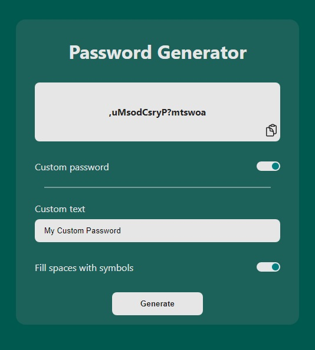

# Vue Password Generator

This is a practice project with Vue.JS, it is a password generator that, in addition to generating them, allows you to copy them to the clipboard.  It also allows you to choose the length of the password, if you want it to have numbers, uppercase, lowercase and/or symbols.  It even has a section to be able to generate a secure password, from a phrase that you choose, mixing the characters in the phrase. In this way, you will have a personalized password, but it is safe because it is not your literal phrase.  It is a very simple application but it can be very useful.

## Screenshots

  
  

